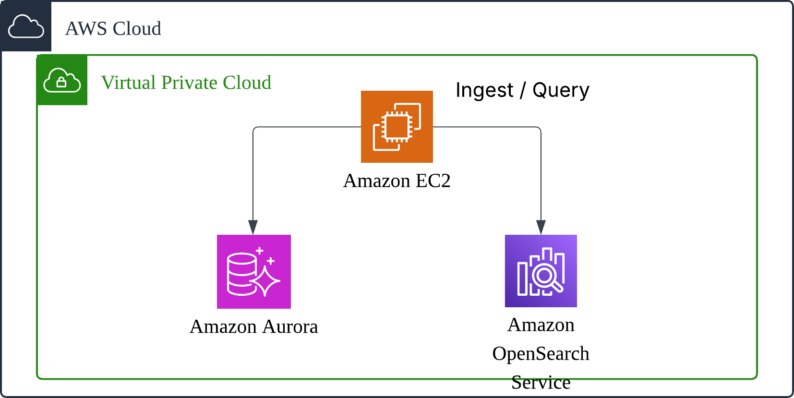

# Aurora MySQL vs Amazon OpenSearch 실시간 로그 분석 성능 비교

## 1. 개요

### 1.1 PoC 목적

본 PoC는 실시간 로그 데이터에 대해 **Aurora MySQL(VARCHAR 컬럼 방식)**과 **Amazon OpenSearch**의 분석 성능을 정량적으로 비교하여, 실시간 로그 분석 워크로드에 적합한 서비스를 선정하는 것을 목적으로 합니다.

### 1.2 배경

현재 시스템에서 발생하는 파라미터로그를 Aurora MySQL의 VARCHAR 컬럼에 JSON 문자열로 저장하고 있습니다. 해당 컬럼에는 **암호화**가 적용되어 있어, DB 내에서 `JSON_EXTRACT()` 등으로 JSON 필드를 직접 분석하는 것이 불가능한 상황입니다.

### 1.3 목표

**암호화가 불필요한 데이터**(자계값, BLE 신호 점수, zone 정보, 장치 상태 등)만 **별도 저장소에 평문으로 분리 저장**하여 실시간 분석 기반을 마련하고자 합니다.

---

## 2. 테스트 환경

### 2.1 인프라 구성

모든 리소스는 동일 VPC의 Private Subnet에 배치하여 동일한 네트워크 구성 환경에서 테스트 했습니다.



### 2.2 데이터베이스 스펙 비교

| 항목 | Aurora MySQL | Amazon OpenSearch |
|------|-------------|-------------------|
| **버전** | Aurora MySQL 3.08.0 (MySQL 8.0 호환) | OpenSearch 2.13 |
| **인스턴스 타입** | db.r6g.large (2 vCPU, 16 GB) | r6g.large.search (2 vCPU, 16 GB) x 2 |
| **노드 수** | Writer 1대 | 데이터 노드 2대 (2 AZ) |
| **스토리지** | Aurora 자동 확장 | EBS gp3 100 GB x 2 노드 |

---

## 3. 테스트 데이터

### 3.1 샘플 데이터 구조

실제 데이터 구조를 기반으로 테스트 데이터를 생성하였습니다.

```sql
CREATE TABLE tgls_param_logs (
    id                       BIGINT AUTO_INCREMENT PRIMARY KEY,
    tgls_prmt_log_val        VARCHAR(4000)  COMMENT '태그리스 파라미터로그 JSON',
    tgls_loc_log_larg_ctt    VARCHAR(3000)  COMMENT '위치로그 Base64',
    tgls_evnt_log_larg_ctt   VARCHAR(3000)  COMMENT '이벤트로그',
    tgls_prmt_flag_val       INT DEFAULT NULL COMMENT '배치 분석 플래그',
    station_id               VARCHAR(10)    COMMENT '역사 ID',
    device_id                VARCHAR(20)    COMMENT '장치 ID',
    rgsr_id                  VARCHAR(20)    COMMENT '등록자 ID',
    rgt_dtm                  VARCHAR(14)    COMMENT '등록일시 (yyyyMMddHHmmss)',
    moapp_trns_trd_trnc_id   VARCHAR(70)    COMMENT '모바일앱 트랜잭션ID',
    INDEX idx_rgt_dtm    (rgt_dtm),
    INDEX idx_station_id (station_id),
    INDEX idx_device_id  (device_id)
) ENGINE=InnoDB DEFAULT CHARSET=utf8mb4;
```

**샘플 파라미터로그 JSON 구조 (키 a~u):**

```json
{"a":"114642445","b":"O","c":"1000","d":"-1252","e":"114644741",
 "f":"219,4782","g":"114645862","h":"642,1173","i":"114646724",
 "j":"675,237","k":"114645966","l":"-1332","m":"675,237",
 "n":"114646730","o":"","p":"","t":"2","u":"NORMAL/OFF/FOREGROUND_SERVICE"}
```

| 주요 필드 | 의미 |
|-----------|------|
| `a` | 역사 도착 시간 (타임스탬프) |
| `b` | 최초 zone (I: 입장, O: 출장) |
| `d` | 자계최대값 (정수, 핵심 분석 대상) |
| `t` | 거래 타입 코드 |
| `u` | 장치 상태 |

### 3.2 샘플 데이터 규모

| 항목 | 값 |
|------|-----|
| 총 건수 | 10,000,000 건 |
| 역사 수 | 300개 |
| 장치 수 | 2,972대 (역사당 평균 10대) |
| 데이터 기간 | 30일 (2026-03-17 ~ 2026-04-16) |
| 이상 거래 비율 | 15% |

### 3.3 저장 방식 비교

| 항목 | Aurora MySQL | Amazon OpenSearch |
|------|-------------|-------------------|
| **파라미터로그** | JSON 문자열을 VARCHAR(4000)에 통째로 저장 | 각 필드를 네이티브 타입(keyword, integer, long)으로 분리 저장 |
| **위치로그** | Base64 문자열을 VARCHAR(3000)에 그대로 저장 | Base64 디코딩 → 자계 평균(`loc_mag_avg`: float)으로 변환 저장 |
| **인덱스** | `rgt_dtm`, `station_id`, `device_id`에 B-Tree 인덱스 | 모든 keyword/integer 필드에 역인덱스 자동 생성 |
| **한글 검색** | `LIKE '%키워드%'` (전수 스캔) | seunjeon 한글 형태소 분석기 (station_name 필드) |

> **핵심 차이**: MySQL은 분석을 위해 매번 `JSON_EXTRACT()` → 타입 변환 → 전수 스캔이 필요하지만, OpenSearch는 적재 시점에 파싱 완료되어 역인덱스 기반 즉시 검색/집계가 가능합니다. 특히 위치로그의 자계 평균은 MySQL에서는 SQL만으로 계산할 수 없지만, OpenSearch에서는 float 필드로 즉시 range 검색이 가능합니다.

---

## 4. 쿼리 성능 비교

벤치마크는 8개 시나리오에 대해 쿼리를 실행하며 응답 시간을 기준으로 비교했습니다.

### 4.1 벤치마크 시나리오

#### 시나리오 1: 자계값 비정상 건수 집계
자계최대값(`d`)이 비정상 범위(-1500 미만 또는 0 초과)인 전체 건수를 집계합니다. 자계 이상 탐지의 기본 쿼리입니다.
- **MySQL**: `SELECT COUNT(*) ... WHERE CAST(JSON_EXTRACT(..., '$.d') AS SIGNED) < -1500 OR > 0`
- **OpenSearch**: `bool` should: `range(mag_max_val < -1500)` + `range(mag_max_val > 0)` + size 0

| | MySQL | OpenSearch | 성능 배수 |
|---|---|---|---|
| 응답 시간 | 183,971 ms (~3분 4초) | 31 ms | **6,026x** |
| 결과 건수 | 1,501,021건 | 1,501,021건 | 일치 |

#### 시나리오 2: 자계 이상 + 위치로그 결합 분석 (고객 핵심 요구)
자계최대값이 비정상이면서 위치로그의 자계 측정 점수 평균이 50%(128) 이하인 거래 건수를 집계합니다.
- **MySQL**: `JSON_EXTRACT` + CAST + WHERE (자계값 조건만 가능. **위치로그 Base64 파싱은 SQL로 불가능** → 별도 배치 필수)
- **OpenSearch**: `bool` must: `range(mag_max_val)` + `range(loc_mag_avg)` (두 조건 모두 실시간 적용)

| | MySQL | OpenSearch | 성능 배수 |
|---|---|---|---|
| 응답 시간 | 122,999 ms (~2분 3초) | 106 ms | **1,484.4x** |

#### 시나리오 3: 역사별/장치별 이상 거래 집계
자계값 비정상인 거래를 역사ID × 장치ID별로 건수 집계합니다. 이상 장비 식별 및 교체 우선순위 결정에 활용합니다.
- **MySQL**: `JSON_EXTRACT` × 2 + WHERE + GROUP BY 2컬럼 (전수 스캔)
- **OpenSearch**: `bool` filter + nested `terms` aggregations

| | MySQL | OpenSearch | 성능 배수 |
|---|---|---|---|
| 응답 시간 | 128,252 ms (~2분 8초) | 625 ms | **647.8x** |

#### 시나리오 4: 시간대별 거래 추이
등록일시의 시간(hour)별 거래 건수를 집계합니다. 출퇴근 피크 분석, 시간대별 트래픽 모니터링에 해당합니다.
- **MySQL**: `SUBSTR(rgt_dtm, 9, 2)` + GROUP BY (10M rows 전수 스캔)
- **OpenSearch**: `date_histogram` aggregation on `rgt_dtm`

| | MySQL | OpenSearch | 성능 배수 |
|---|---|---|---|
| 응답 시간 | 9,232 ms (~9.2초) | 243 ms | **57.0x** |

#### 시나리오 5: zone별 IN/OUT 통계
입장(I)/출장(O) zone별 거래 건수 분포를 집계합니다.
- **MySQL**: `JSON_EXTRACT(tgls_prmt_log_val, '$.b')` + GROUP BY (전수 스캔 + JSON 파싱)
- **OpenSearch**: `terms` aggregation on `initial_zone` (keyword 역인덱스)

| | MySQL | OpenSearch | 성능 배수 |
|---|---|---|---|
| 응답 시간 | 74,421 ms (~1분 14초) | 74 ms | **2,304.2x** |

#### 시나리오 6: 장치 상태별 이상률
장치 상태(`u`)별 전체 건수 및 자계 이상 건수를 집계합니다. 장치 상태와 이상 발생의 상관관계 분석에 활용합니다.
- **MySQL**: `JSON_EXTRACT` × 2 + CASE + GROUP BY (10M rows에 JSON 2회 파싱)
- **OpenSearch**: `terms` agg on `device_status` + `range` sub-aggregation

| | MySQL | OpenSearch | 성능 배수 |
|---|---|---|---|
| 응답 시간 | 203,693 ms (~3분 24초) | 1,439 ms | **356.7x** |

#### 시나리오 7: 특정 역사 거래 이력 조회
특정 역사(ST-001)의 최근 100건 거래를 시간 역순으로 조회합니다.
- **MySQL**: `WHERE station_id = 'ST-001' ORDER BY rgt_dtm DESC LIMIT 100` (B-Tree 인덱스 활용)
- **OpenSearch**: `term` query + `sort` + `size`

| | MySQL | OpenSearch | 성능 배수 |
|---|---|---|---|
| 응답 시간 | 110 ms | 134 ms | **1.3x** |

#### 시나리오 8: 역사명 전문 검색
'강남' 키워드가 포함된 역사의 거래를 검색합니다.
- **MySQL**: `WHERE tgls_prmt_log_val LIKE '%강남%' LIMIT 50` (VARCHAR 전수 스캔)
- **OpenSearch**: `match` query on `station_name` (seunjeon 한글 형태소 분석기)

| | MySQL | OpenSearch | 성능 배수 |
|---|---|---|---|
| 응답 시간 | 24,481 ms (~24.5초) | 141 ms | **507.6x** |

### 4.2 시나리오별 결과 종합

| # | 시나리오 | MySQL (ms) | OpenSearch (ms) | 성능 배수 |
|---|---------|-----------|---------|-----------|
| 1 | 자계값 비정상 COUNT | 183,971 | 31 | **6,026x** |
| 2 | 자계 이상 + 위치로그 결합 | 122,999 | 106 | **1,484.4x** |
| 3 | 역사별/장치별 이상 집계 | 128,252 | 625 | **647.8x** |
| 4 | 시간대별 거래 추이 | 9,232 | 243 | **57.0x** |
| 5 | zone별 IN/OUT 통계 | 74,421 | 74 | **2,304.2x** |
| 6 | 장치 상태별 이상률 | 203,693 | 1,439 | **356.7x** |
| 7 | 특정 역사 이력 조회 | 110 | 134 | **1.3x** |
| 8 | 역사명 전문 검색 | 24,481 | 141 | **507.6x** |

### 4.3 분석

#### 전수 스캔 시나리오 (2, 3, 5, 6): OpenSearch 356~2,304배 우위

JSON 내부 필드를 조건으로 사용하는 쿼리에서 MySQL은 10M 행 전체를 스캔하며 매 행마다 `JSON_EXTRACT()` + 타입 변환을 수행해야 합니다. OpenSearch는 역인덱스에서 해당 조건의 문서만 즉시 필터링하므로, 데이터 양에 관계없이 밀리초 단위 응답이 가능합니다.

#### 핵심 시나리오 (2): 1,484배 + MySQL에서 불가능한 분석

시나리오 2는 고객이 직접 요구한 "자계값 범위 + 위치로그 자계 평균" 결합 분석입니다. MySQL에서는 **자계값 조건만 적용 가능**하고, Base64 위치로그를 SQL로 파싱하여 자계 평균을 계산하는 것은 불가능합니다. OpenSearch에서는 적재 시점에 위치로그를 파싱하여 `loc_mag_avg` float 필드로 저장하므로, 두 조건을 모두 적용한 실시간 쿼리가 가능합니다. 이것이 현재 배치 플래그 방식을 실시간으로 전환할 수 있는 핵심 근거입니다.

#### LIMIT 쿼리 (7): MySQL 동등 또는 우위

`LIMIT 100`으로 결과 건수를 제한하는 쿼리에서는 MySQL이 조기 종료(early termination)를 활용하여 동등하거나 더 빠른 성능을 보입니다. 시나리오 7에서 MySQL이 `station_id` B-Tree 인덱스를 활용하여 110ms에 응답한 것은 인덱스가 있는 단건 조회에서 MySQL이 충분한 성능을 제공함을 보여줍니다.

#### 전문 검색 (8): OpenSearch 508배 우위

한글 역사명 검색에서 MySQL은 `LIKE '%강남%'`로 VARCHAR 전체를 스캔하는 반면, OpenSearch는 seunjeon 형태소 분석기로 토크나이징된 역인덱스를 활용합니다.

---

## 6. 결론 및 권고사항

### 6.1 성능 비교 종합

8개 벤치마크 시나리오에서 **전수 스캔이 필요한 분석 쿼리에 대해 OpenSearch가 57~2,304배 빠른 성능**을 보였습니다. 특히 고객의 핵심 분석 요구인 "자계값 + 위치로그 결합 분석"은 MySQL에서는 SQL만으로 수행이 불가능하며, OpenSearch에서는 106ms의 실시간 응답이 가능합니다.

